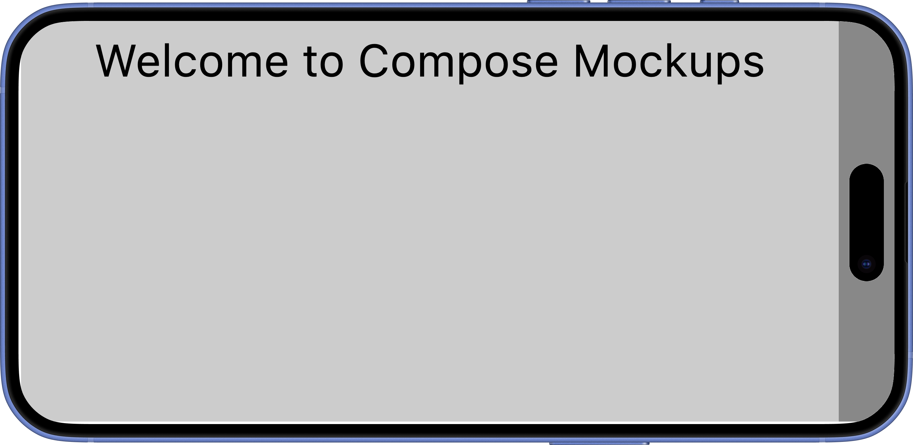
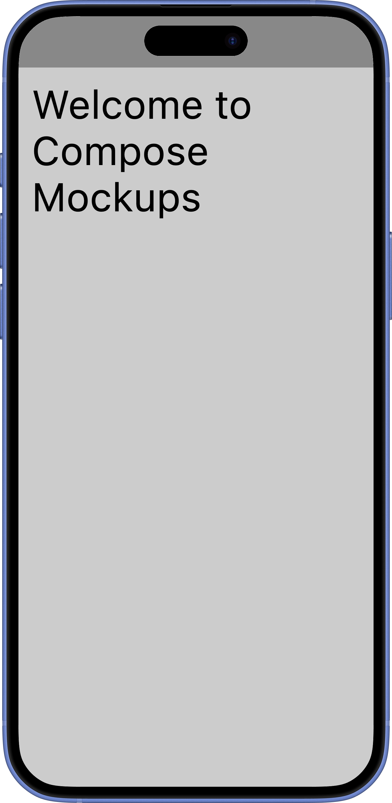
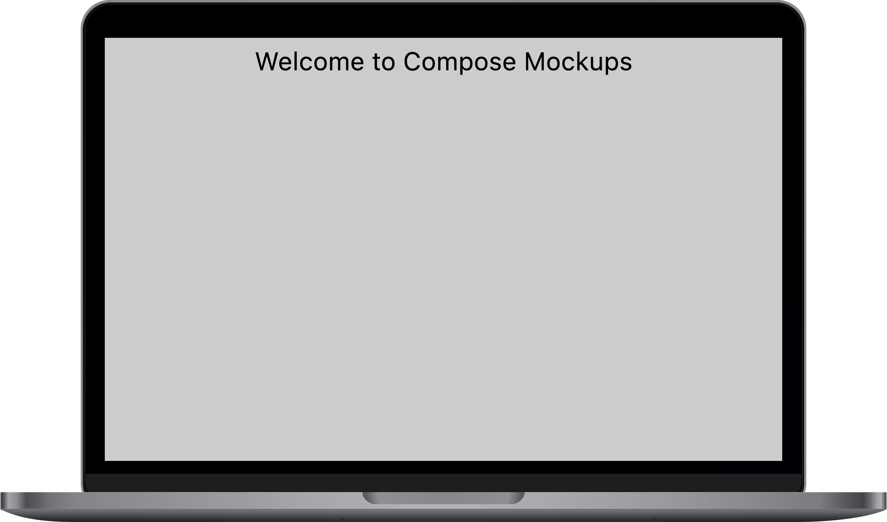

# Compose Mockups

**Compose Mockups** is a plugin that allows you to annotate your Jetpack Compose @Composable
functions and automatically generate screenshots with device frames across multiple devices. Note
that this will not work for Android projects by default. It is for desktop JVM Compose. Read below
for options to get this to work with Android.

---

## Features

- Annotate `@Composable` functions with `@ComposeMockup`
- Automatically generate screenshots for multiple devices
- Easily integrates into CI pipelines
- Zero-boilerplate API with optional safe area support (to account for notches etc.)

---

## Example

```kotlin
@ComposeMockup(
    devices = [DeviceId.IPHONE16PLUS_ULTRAMARINE, DeviceId.MACBOOK_PRO_13_SPACE_GREY],
    orientations = [Orientation.PORTRAIT, Orientation.LANDSCAPE],
)
@Composable
fun ExamplePreview(innerPadding: PaddingValues) {
    Box(
        Modifier
            .fillMaxSize()
            .background(Color.Gray)
            .padding(innerPadding)
            .background(Color.LightGray)
            .padding(16.dp)
    ) {
        Text(
            text = "Welcome to Compose Mockups",
            style = MaterialTheme.typography.h3,
            modifier = Modifier.align(Alignment.TopCenter),
        )
    }
}
```

Just run the generator and screenshots will be created automatically for each device you listed!
This example produces the follow 3 images.

<p align="center">
  
  
  
</p>

---

## Usage

### 1. Add Dependencies

In your module's `build.gradle.kts`:

```kotlin
plugins {
    id("com.google.devtools.ksp") version "2.2.0-2.0.2"
    id("uk.co.lidbit.compose.mockups") version "{{version}}"
}

composeMockups {
    composeVersion.set("YOUR_COMPOSE_VERSION") // required
    mockupsDir.set("my_folder") // optional (default: mockups)
}
```

Make sure your module applies the KSP plugin.

---

### 2. Annotate Your Composables

Use the `@ComposeMockup` annotation on any `@Composable` function you want to screenshot.

You can optionally include a `PaddingValues` parameter named `innerPadding` to receive the safe area
insets of the device (for framed screenshots).

You can also define reusable presets by creating custom annotations.

```kotlin
@ComposeMockup(
    devices = [
        DeviceId.MACBOOK_PRO_13_SILVER,
        DeviceId.MACBOOK_PRO_13_SPACE_GREY,
        DeviceId.MACBOOK_PRO_16_SILVER,
        DeviceId.MACBOOK_PRO_16_SPACE_GREY,
    ],
    orientations = [Orientation.LANDSCAPE],
)
annotation class MacbookMockups

@MacbookMockups
@Composable
fun MacbookExample() {
    // Content here
}
```

---

### 3. Run the Generator

Run the gradle task provided by the plugin.

```bash
./gradlew generateComposeMockups
```

This will generate screenshots in a `/mockups` directory (or location your provided in the config)
in your project root.

---

## Device Definitions

Use `DeviceId` enums to specify which devices to use for rendering.

Built-in examples:

- `DeviceId.ANDROID_COMPACT_BLACK`
- `DeviceId.MACBOOK_PRO_13_SILVER`
- `DeviceId.IPHONE16PRO_WHITE_TITANIUM`

All available devices can be
found [here](compose-mockups/compose-mockups/src/main/kotlin/uk/co/lidbit/compose/mockups/annotations/ComposeMockup.kt)

---

## Error Handling

If no `@ComposeMockup` functions are found, the processor logs a warning, but **does not fail the
build**.

This makes it safe to run in CI environments with optional previews.

---

## License

This project is licensed under the MIT License.

---

## Device Frames Attribution

Some device frames are sourced from external assets. Attribution is provided below:

| Device Series                       | Source                                                                                                                            | License                                                         |
|-------------------------------------|-----------------------------------------------------------------------------------------------------------------------------------|-----------------------------------------------------------------|
| Apple iPhone 16                     | [Figma Community - iPhone 16 Series Mockups](https://www.figma.com/community/file/1423407561713300290)                            | [CC BY 4.0](https://creativecommons.org/licenses/by/4.0/)       |
| Android (Compact, Medium, Expanded) | [Figma Community - Android Compact, Medium, and Expanded Device Frames](https://www.figma.com/community/file/1425969168466168269) | [CC BY 4.0](https://creativecommons.org/licenses/by/4.0/)       |
| IMac and Macbook                    | [Design at Meta - Devices](https://design.facebook.com/tools/devices)                                                             | [Disclaimer](https://design.facebook.com/resources-disclaimer/) |

> **Note:** Use of these assets must comply with their original licensing terms. Be sure to review
> and respect the licenses if redistributing images.

---

## Using This Plugin with Android Projects

This plugin will **not work on Android projects directly** because it depends on
`org.jetbrains.skia` for rendering screenshots, which is only available in a JVM environment and not
supported on Android.

To get this working with an Android app, you have a couple of options:

1. **Create a separate JVM module**  
   You can create a dedicated JVM module in your project that depends on the UI code of your Android
   app (e.g., the Compose UI components). This JVM module can use JetBrains Compose and
   `org.jetbrains.skia` to generate screenshots or mockups. This way, the plugin runs in a desktop
   JVM context, while your Android app stays separate.

2. **Add a JVM target to your Android project (Compose Multiplatform)**  
   Convert your Android project into a Compose Multiplatform project by adding a JVM desktop target
   alongside your Android target. This enables you to run your Compose UI code on both Android and
   JVM desktop. Your plugin can then operate in the JVM environment, using `org.jetbrains.skia`,
   while sharing UI code with Android.

Both approaches allow you to leverage this plugin’s functionality without running into the Android
platform limitations related to native rendering dependencies.

---

## Contributing

Pull requests are welcome! Whether it's improvements, bug fixes, or adding new device frames, feel
free to contribute.

If you manage to get this working on Android targets, I’d love to see it!
